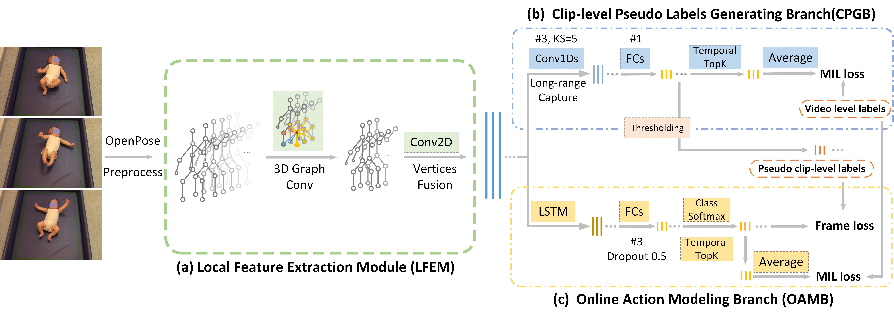

## Weakly Supervised Online Action Detection for Infant General Movements

This is an official implementation of MICCAI 2022 paper [Weakly Supervised Online Action Detection for Infant General Movements.]()



### Environment
The code is developed on Ubuntu 18.04.6. with NVIDIA 3090 GPUs. Other platforms or GPU cards are not fully tested.

To reproduce our python environment by `conda`, one can simply using the following command: 
```
conda env create -f environment.yaml
```

If you have already prepared python 3.7, you can also reproduce environment by `pip`:
```
pip install -r requirements.txt
```
### Quick start
##### 1. Clone repository.
```
git clone https://github.com/scofiedluo/WO-GMA.git
cd WO-GMA
```

##### 2. Data preparation
Our model takes processed skeleton squences as input. You could extract skeletons by [OpenPose](https://github.com/CMU-Perceptual-Computing-Lab/openpose), and preprocess by this [repository](https://github.com/cchamber/Infant_movement_assessment). 

* **skeleton data**
A `.npy` file with dimension $B \times C \times T \times N$, where $B$ is the number of videos, $C$ is the number of feature channels, $T$ is the length of skeleton sequence, and $N$ is the number of skeleton vertices. In our setting, $C = 3$, $T =6000$, $N = 18$.
* **video-level labels**
A `.pkl` tuple file contains two lists, that is `(video_name list, label list)`. Here the index of each video is same as keleton data.
* **video info**
`.csv` file to record all video information in dataset. This file need to include some necessary fields:

| video_name | nframes | duration (second)|label|FPS|width|width|
| ------ | ------ | ------ | ------ | ------ | ------ | ------ |
| string | int, number of frames in original video | double, time duration of video |string, video-level label|double|frame width|frame width|
* **data split**
`.csv` files to split you dataset into different part. These files need to include some necessary fields:

| video_name | nframes | duration (second)|label|FPS|index|
| ------ | ------ | ------ | ------ | ------ | ------ |
| string | int, number of frames in original video | double, time duration of video |string, video-level label|double|int, video index in skeleton data|

* **frame-level labels**
`.csv` files record frame-level annotations. This file need to include some necessary fields:

| video_name | nframes | duration (second)|label|FPS|segments_frame|segments_time|
| ------ | ------ | ------ | ------ | ------ | ------ | ------ |
| string | int, number of frames in original video | double, time duration of video |string, video-level label|double|frame annotation in one video, looks like `"[(228, 2834), (2983, 3233)]"`|convert frame annotation into time axis, looks like `"[(9.13, 113.39), (119.35, 129.33)]"`|

**Note:** All video names should be unique.
##### 2. Training and evaluation
```
python main.py --experiment 'train_eval' --device {your GPU id, default 0} \
               --data_path {path to your skeleton data} \
               --label_path {path to your video level label} \
               --video_info_path {path to your video information file} \
               --split_train_csv_path {path to training split} \
               --split_test_csv_path {path to testing split} \
               --frame_annotations {path to your frame-level labels}
```
##### 3. Inference
```
python inference.py --work-dir 'inference_results/' \
                    --experiment 'test_dev' --device {your GPU id, default 0} \
                    --checkpoint {path to your trained model checkpoint} \
                    --data_path {path to your skeleton data} \
                    --label_path {path to your video level label} \
                    --video_info_path {path to your video information file} \
                    --split_test_csv_path {path to testing split} \
                    --frame_annotations {path to your frame-level labels}
```

### Citation
If you find this work or code is helpful in your research, please cite:
```
@article{luo2022weakly,
  title={Weakly Supervised Online Action Detection for Infant General Movements},
  author={Luo, Tongyi and Xiao, Jia and Zhang, Chuncao and Chen, Siheng and Tian, Yuan and Yu, Guangjun and Dang, Kang and Ding, Xiaowei},
  journal={arXiv preprint arXiv:2208.03648},
  year={2022}
}
```

### Contact
Please email `scofiedluo@gmail.com` for further questions.
